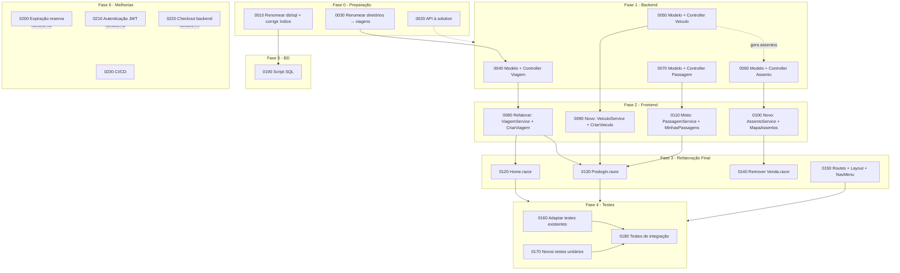

# Roadmap de Desenvolvimento da Pivotagem — TicketPrime → TripPrime

> **Propósito:** Este documento descreve a trajetória completa do desenvolvimento da pivotagem do TicketPrime (venda de ingressos para eventos) para o TripPrime (comercialização de assentos em transportes para excursões). Ele organiza as **specs**, a **ordem de execução** e as **dependências** entre cada etapa.
>
> **Documentos de referência:**
> - [`pivotagem.md`](pivotagem.md) — Visão da pivotagem (motivação, conceitos, funcionalidades)
> - [`arquitetura-pivotagem.md`](arquitetura-pivotagem.md) — Arquitetura detalhada da pivotagem
> - [`../arquitetura.md`](../arquitetura.md) — Arquitetura original do TicketPrime
> - [`../visao.md`](../visao.md) — Visão original do produto

---

## Sumário

1. [Visão Geral do Roadmap](#1-visão-geral-do-roadmap)
2. [Tabela Mestra de Specs](#2-tabela-mestra-de-specs)
3. [Fase 0 — Preparação e Correções](#3-fase-0--preparação-e-correções)
4. [Fase 1 — Backend: Novos Controllers](#4-fase-1--backend-novos-controllers)
5. [Fase 2 — Frontend: Serviços e Componentes](#5-fase-2--frontend-serviços-e-componentes)
6. [Fase 3 — Refatoração Final e Limpeza](#6-fase-3--refatoração-final-e-limpeza)
7. [Fase 4 — Testes](#7-fase-4--testes)
8. [Fase 5 — Banco de Dados (PostgreSQL)](#8-fase-5--banco-de-dados-postgresql)
9. [Fase 6 — Melhorias e Correções Pós-Pivotagem](#9-fase-6--melhorias-e-correções-pós-pivotagem)
10. [Dependências Entre Etapas](#10-dependências-entre-etapas)
11. [Estimativa de Esforço](#11-estimativa-de-esforço)

---

## 1. Visão Geral do Roadmap

O desenvolvimento da pivotagem está organizado em **7 fases**, executadas sequencialmente. Cada fase contém um conjunto de tarefas com numeração única no formato `NNNN` (incremento de 10 em 10, conforme padrão definido em `CLAUDE.md`).

```
Fase 0 ──> Fase 1 ──> Fase 2 ──> Fase 3 ──> Fase 4 ──> Fase 5 ──> Fase 6
(Prep)     (Backend)  (Frontend) (Refactor) (Testes)   (BD)       (Melhorias)
```

| Fase | Nome | Descrição | Prioridade |
|:----:|------|-----------|:----------:|
| 0 | Preparação e Correções | Renomeações estruturais, correção de bugs no SQL | 🔴 Alta |
| 1 | Backend: Novos Controllers | Criação dos controllers Viagens, Veículos, Assentos, Passagens | 🔴 Alta |
| 2 | Frontend: Serviços e Componentes | Refatoração de serviços/componentes existentes + criação dos que são realmente novos | 🔴 Alta |
| 3 | Refatoração Final e Limpeza | Adaptação de Home, Poslogin + remoção de Venda.razor + rotas/navegação | 🔴 Alta |
| 4 | Testes | Adaptação de testes existentes + novos testes (unitários e integração) | 🟡 Média |
| 5 | Banco de Dados | Atualização do script SQL com novas tabelas | 🟡 Média |
| 6 | Melhorias Pós-Pivotagem | Correções de limitações conhecidas | 🟢 Baixa |

---

## 2. Tabela Mestra de Specs

> A coluna **Status** indica o progresso de implementação. Use `[ ]` = pendente, `[>]` = em andamento, `[x]` = concluído.
>
> Cada spec possui um documento individual em `docs/pivotagem/specs/` com detalhes completos (campos, validações, arquivos, critérios de aceitação).

| Código | Spec | Tipo | Fase | Status |
|:------:|------|:----:|:----:|:------:|
| **Fase 0 — Preparação e Correções** |||||
| 0010 | Renomear `db/sql` → `db/script.sql` e corrigir índice inválido | Correção | 0 | [x] |
| 0020 | Adicionar `src/api.csproj` à solution | Correção | 0 | [x] |
| 0030 | Renomear diretórios `eventos/` e `images/eventos/` → `viagens/` | Renomeação | 0 | [x] |
| **Fase 1 — Backend** |||||
| 0040 | Criar modelo `Viagem` + `ViagensController` + registrar rotas | Novo | 1 | [x] |
| 0050 | Criar modelo + controller `Veiculo` + registrar rotas | Novo | 1 | [x] |
| 0060 | Criar modelo + controller `Assento` + registrar rotas | Novo | 1 | [x] |
| 0070 | Criar modelo + controller `Passagem` + registrar rotas | Novo | 1 | [x] |
| **Fase 2 — Frontend** |||||
| 0080 | Refatorar `EventoService` → `ViagemService` + `Criarevento.razor` → `CriarViagem.razor` | **Refatorar** | 2 | [x] |
| 0090 | Criar `VeiculoService` + `CriarVeiculo.razor` | Novo | 2 | [x] |
| 0100 | Criar `AssentoService` + `MapaAssentos.razor` | Novo | 2 | [x] |
| 0110 | Criar `PassagemService` + refatorar `Meusingressos.razor` → `MinhasPassagens.razor` | Misto | 2 | [x] |
| **Fase 3 — Refatoração Final** |||||
| 0120 | Refatorar `Home.razor` | Refatorar | 3 | [x] |
| 0130 | Refatorar `Poslogin.razor` | Refatorar | 3 | [x] |
| 0140 | Remover `Venda.razor` e redirecionar rota | Remover | 3 | [x] |
| 0150 | Atualizar `Routes.razor`, `MainLayout.razor` e `NavMenu.razor` | Refatorar | 3 | [x] |
| **Fase 4 — Testes** |||||
| 0160 | Adaptar testes existentes para o domínio TripPrime | Adaptar | 4 | [ ] |
| 0170 | Criar novos testes unitários | Novo | 4 | [ ] |
| 0180 | Adicionar testes de integração | Novo | 4 | [ ] |
| **Fase 5 — Banco de Dados** |||||
| 0190 | Atualizar script SQL com novas tabelas | Atualizar | 5 | [ ] |
| **Fase 6 — Melhorias** |||||
| 0200 | Implementar expiração de reserva (timer servidor) | Novo | 6 | [ ] |
| 0210 | Implementar autenticação JWT | Novo | 6 | [ ] |
| 0220 | Implementar checkout real no backend | Novo | 6 | [ ] |
| 0230 | Configurar CI/CD com GitHub Actions | Novo | 6 | [ ] |

---

## 3. Fase 0 — Preparação e Correções

> **Objetivo:** Realizar as correções estruturais necessárias antes de iniciar o desenvolvimento da pivotagem.
>
> **Documentos:** `docs/pivotagem/specs/0010-renomear-sql-corrigir-indice.md` a `0030-renomear-diretorios-viagens.md`

- **Spec 0010** — Renomear `db/sql` → `db/script.sql` (arquivo sem extensão `.sql`, perda de 1 ponto na AV1) e corrigir índice inválido na linha 64 (`DataEvento` não existe, a coluna é `"Data"`)
- **Spec 0020** — Adicionar `src/api.csproj` à solution `billet_2.slnx` (verificar duplicidade com `TicketPrimeSolucao-pivotagem.sln`)
- **Spec 0030** — Renomear diretório `src/eventos/` → `src/viagens/` e `wwwroot/images/eventos/` → `wwwroot/images/viagens/` (apenas mover arquivos, sem alterar conteúdo)

---

## 4. Fase 1 — Backend: Novos Controllers

> **Objetivo:** Implementar todos os novos controllers da API para o domínio TripPrime (Minimal API, classes estáticas, métodos de extensão).
>
> **Documentos:** `docs/pivotagem/specs/0040-modelo-controller-viagem.md` a `0070-modelo-controller-passagem.md`

- **Spec 0040** — Criar modelo `Viagem` e refatorar `EventosController.cs` → `ViagensController.cs` (4 endpoints: listar, listar/{id}, pesquisar, cadastrar). **Registrar rotas em `Program.cs`** e remover as antigas de eventos.
- **Spec 0050** — Criar modelo + controller `Veiculo` (Modelo, Placa única, Capacidade = Linhas×Colunas, Tipo). Ao cadastrar, gerar assentos automaticamente. **Registrar rotas em `Program.cs`.**
- **Spec 0060** — Criar modelo + controller `Assento` (VeiculoId, Numero, Tipo, Status; endpoints: mapa, reservar, liberar, bloquear). **Registrar rotas em `Program.cs`.**
- **Spec 0070** — Criar modelo + controller `Passagem` (ViagemId, AssentoId, UsuarioCpf, PrecoPago, Status; endpoints: listar, listar por usuário, comprar, cancelar). **Registrar rotas em `Program.cs`.**

---

## 5. Fase 2 — Frontend: Serviços e Componentes

> **Objetivo:** Refatorar serviços e componentes existentes que têm equivalentes no novo domínio (rename + adapt in place) e criar os que são realmente novos.
>
> **Documentos:** `docs/pivotagem/specs/0080-viagem-service-criar-viagem.md` a `0110-passagem-service-minhas-passagens.md`

- **Spec 0080** — **Refatorar** (rename in place): `EventoService.cs` → `ViagemService.cs` + `Criarevento.razor` → `CriarViagem.razor`. Adaptar modelos e chamadas HTTP. O código existente é reaproveitado (~70%), evitando retrabalho.
- **Spec 0090** — **Criar** (novo): `VeiculoService` + `CriarVeiculo.razor` (não existe equivalente anterior). Formulário de cadastro de veículo com Capacidade calculada = Linhas×Colunas.
- **Spec 0100** — **Criar** (novo): `AssentoService` + `MapaAssentos.razor` (não existe equivalente — `Venda.razor` é setor VIP/Normal,非常 diferente de um mapa de poltronas). Mapa visual interativo com seleção de assento.
- **Spec 0110** — **Misto:** Criar `PassagemService` (novo) + refatorar `Meusingressos.razor` → `MinhasPassagens.razor` (rename + adapt in place, ~70% de reaproveitamento).

---

## 6. Fase 3 — Refatoração Final e Limpeza

> **Objetivo:** Adaptar os componentes Blazor restantes e remover apenas o que não tem reaproveitamento.
>
> **Documentos:** `docs/pivotagem/specs/0120-home-razor.md` a `0150-routes-layout-navmenu.md`

- **Spec 0120** — Refatorar `Home.razor` (hero banner + cards exibem viagens; usar `ViagemService`)
- **Spec 0130** — Refatorar `Poslogin.razor` (dashboard exibe viagens; menu admin com links Criar Viagem e Criar Veículo)
- **Spec 0140** — Remover `Venda.razor` (único componente que realmente não se reaproveita — lógica de setor VIP/Normal é muito diferente de mapa de assentos). Rota `/vendas/{id}` redireciona para `/viagem/{id}/assentos`
- **Spec 0150** — Atualizar `Routes.razor`, `MainLayout.razor` e `NavMenu.razor` (novas rotas e links de navegação; remover rotas antigas)

---

## 7. Fase 4 — Testes

> **Objetivo:** Adaptar os testes existentes para o novo domínio e criar novos testes (unitários e de integração).
>
> **Documentos:** `docs/pivotagem/specs/0160-adaptar-testes-existentes.md` a `0180-testes-integracao.md`

- **Spec 0160** — Adaptar testes existentes para o domínio TripPrime: `TesteVeiculoCapacidade`, `TestePrecoPassagemPositivo`, `TesteReservaAssentoValida`, `TestePassagemSemCpf`; manter `TesteDescontoValido` inalterado
- **Spec 0170** — Criar novos testes unitários: `TesteSelecaoAssento`, `TesteReservaExpirada`, `TesteViagemSemVeiculo`, `TesteAssentoDuplicado`
- **Spec 0180** — Criar testes de integração com `Microsoft.AspNetCore.Mvc.Testing` (fluxo completo: veículo → viagem → assento → compra → cancelamento)

---

## 8. Fase 5 — Banco de Dados (PostgreSQL)

> **Objetivo:** Atualizar o script DDL do PostgreSQL com as novas tabelas do domínio TripPrime.
>
> **Documento:** `docs/pivotagem/specs/0190-script-sql-pivotagem.md`

- **Spec 0190** — Atualizar `db/script.sql`: criar tabelas `Viagens`, `Veiculos`, `Assentos`, `Passagens`; remover `Eventos` e `Reservas`; incluir FKs, CHECK, UNIQUE; corrigir índice obsoleto

---

## 9. Fase 6 — Melhorias e Correções Pós-Pivotagem

> **Objetivo:** Corrigir limitações conhecidas e implementar melhorias não bloqueantes.
>
> **Documentos:** `docs/pivotagem/specs/0200-expiracao-reserva.md` a `0230-ci-cd-github-actions.md`

- **Spec 0200** — Implementar expiração de reserva (`IHostedService`; prazo: 15min; resolve limitação #5)
- **Spec 0210** — Implementar autenticação JWT (endpoint `POST /api/auth/login`; token no header `Authorization`; resolve limitação #2)
- **Spec 0220** — Implementar checkout real no backend (validação + cupom + cálculo no servidor; resolve limitação #4)
- **Spec 0230** — Configurar CI/CD com GitHub Actions (`dotnet build` + `dotnet test` em cada push)

---

## 10. Dependências Entre Etapas



### Dependências Críticas (Formato Máquina)

```
0080 -> 0040  # ViagemService + CriarViagem depende de ViagensController
0090 -> 0050  # VeiculoService + CriarVeiculo depende de VeiculosController
0100 -> 0060  # AssentoService + MapaAssentos depende de AssentosController
0110 -> 0070  # PassagemService + MinhasPassagens depende de PassagensController
0120 -> 0080  # Home depende de ViagemService
0130 -> 0080,0090,0110  # Poslogin depende dos services
0190 -> 0010  # Script SQL depende da renomeação do arquivo
```

---

## 11. Estimativa de Esforço

> **Nota:** As estimativas abaixo são aproximadas e consideram um desenvolvedor familiarizado com o código base e a stack tecnológica (.NET 10, Blazor, Minimal API).

| Fase | Tarefas | Estimativa (horas) | Complexidade |
|:----:|---------|:------------------:|:------------:|
| 0 | 3 tarefas (renomeações, solution) | 1h | 🟢 Baixa |
| 1 | 4 tarefas (controllers + modelos + rotas) | 5-7h | 🔴 Alta |
| 2 | 4 tarefas (2 refatorar + 2 novos) | 5-7h | 🔴 Alta |
| 3 | 4 tarefas (refatoração final) | 2-3h | 🟡 Média |
| 4 | 3 tarefas (adaptar + novos + integração) | 4-5h | 🟡 Média |
| 5 | 1 tarefa (script SQL) | 2-3h | 🟡 Média |
| 6 | 4 tarefas (JWT, expiração, checkout, CI/CD) | 6-10h | 🔴 Alta |
| **Total** | **23 tarefas** | **25-36h** | — |

### Distribuição por Camada

```
Backend (API):        ~38%  (Fase 1 + parte da Fase 6)
Frontend (Blazor):    ~32%  (Fase 2 + Fase 3)
Testes:               ~16%  (Fase 4)
Infra/BD/DevOps:      ~14%  (Fase 0 + Fase 5 + parte da Fase 6)
```

---

> **Última atualização:** 29/05/2026
>
> **Próximos passos:** Iniciar pela Fase 0 (Preparação e Correções) para resolver os problemas estruturais antes de qualquer desenvolvimento novo.
